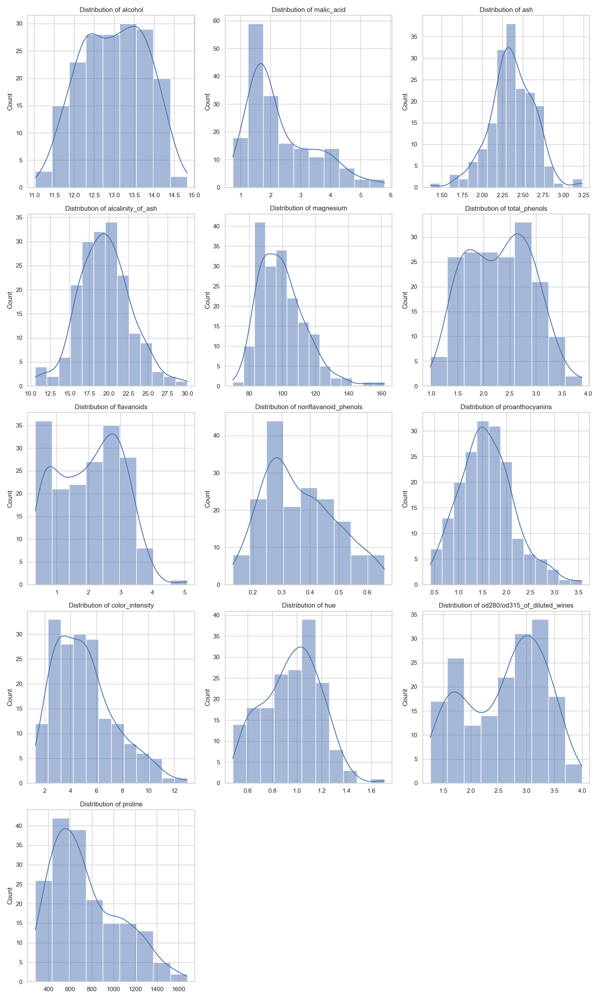
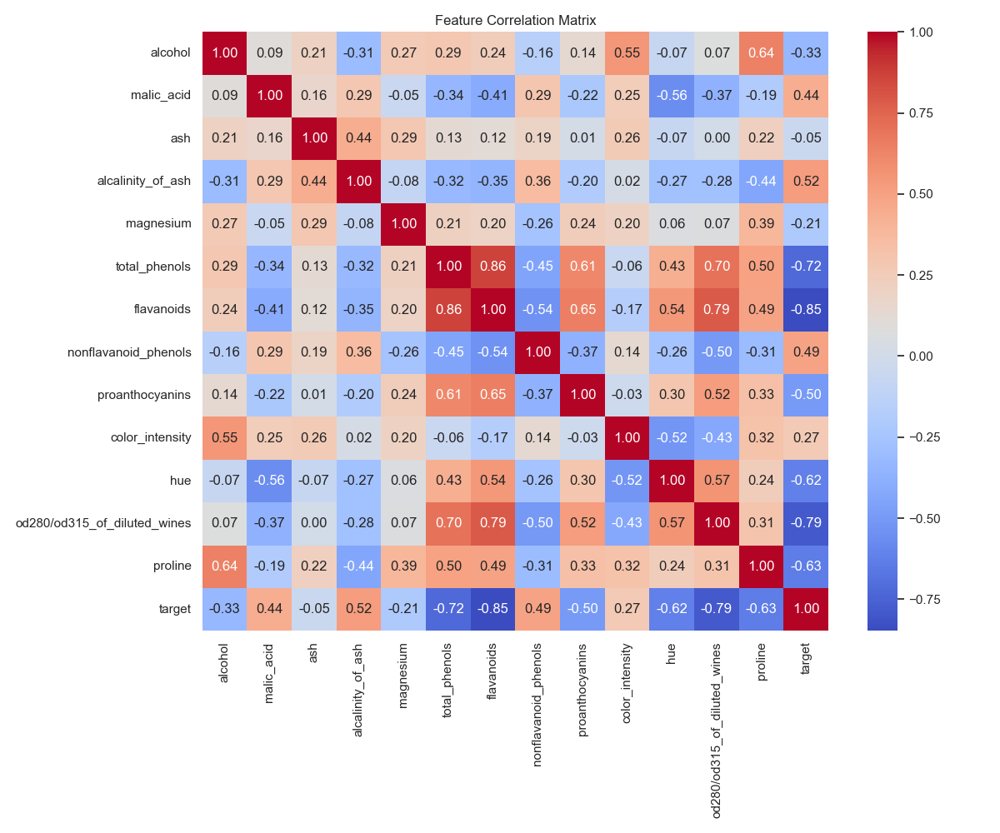
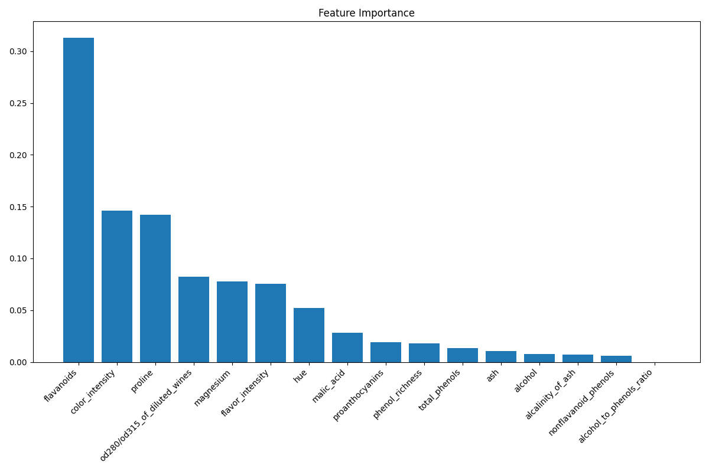
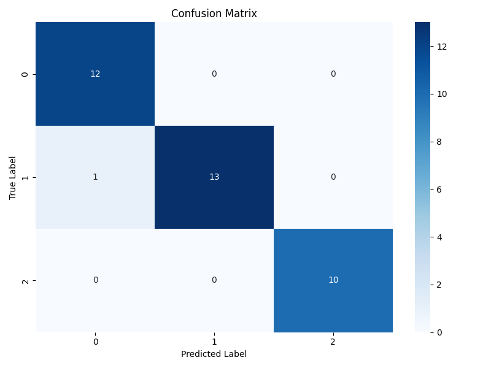
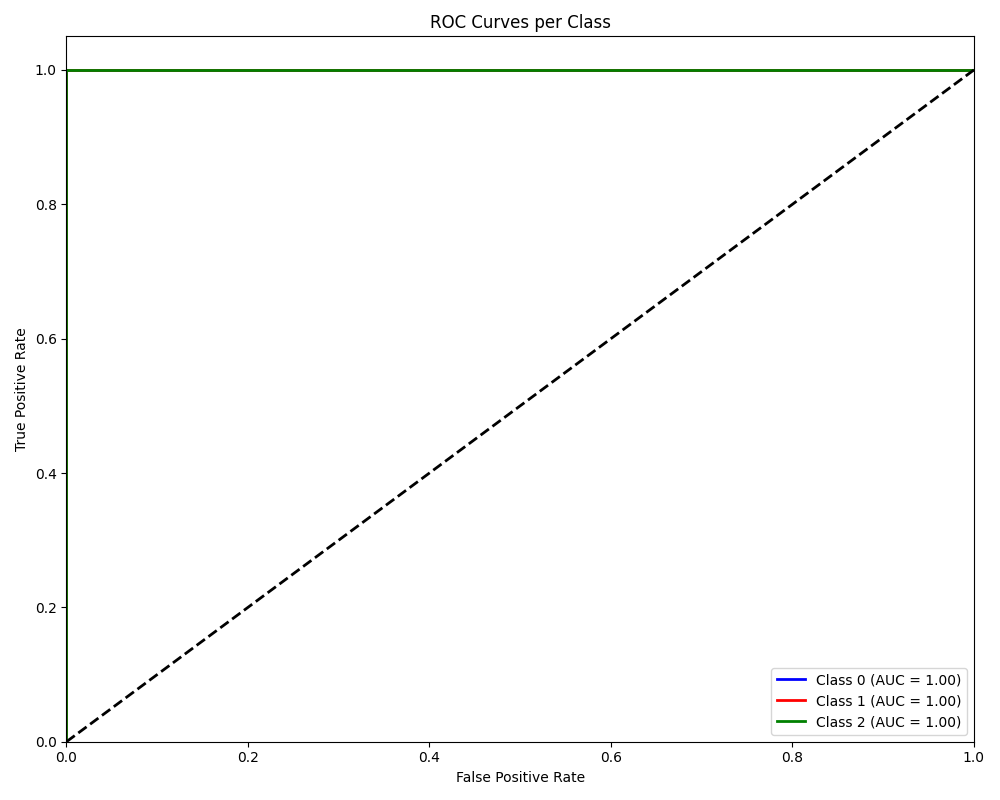

# Wine Classification Model Evaluation Report

## 1. Executive Summary
The XGBoost model achieved an overall accuracy of **97.22%** on the test set. The pipeline included EDA, Feature Engineering (3 derived features), and Hyperparameter Tuning.

## 2. Dataset Overview
*   **Test Samples**: 36
*   **Features**: 16 (Original + Derived)
*   **Classes**: 3 (Wine Cultivars)

### Key Visualizations
#### Feature Distributions


#### Correlation Matrix


## 3. Model Configuration
### Best Hyperparameters
```json
{
  "subsample": 0.8,
  "n_estimators": "400",
  "min_child_weight": "2",
  "max_depth": "5",
  "learning_rate": 0.29,
  "colsample_bytree": 0.7
}
```

### Top 5 Important Features
1. flavanoids (0.3131)
2. color_intensity (0.1464)
3. proline (0.1420)
4. od280/od315_of_diluted_wines (0.0823)
5. magnesium (0.0778)



## 4. Performance Metrics
### Classification Report
| Class | Precision | Recall | F1-Score | Support |
| :--- | :--- | :--- | :--- | :--- |
| 0 | 0.9231 | 1.0000 | 0.9600 | 12.0 |
| 1 | 1.0000 | 0.9286 | 0.9630 | 14.0 |
| 2 | 1.0000 | 1.0000 | 1.0000 | 10.0 |

**Macro Avg**: F1 0.9743
**Weighted Avg**: F1 0.9723

### Confusion Matrix


### ROC Curves


## 5. Recommendations
*   **Model Deployment**: The model shows excellent performance and is ready for deployment.
*   **Monitoring**: Monitor for data drift as the current dataset is small (178 samples).
